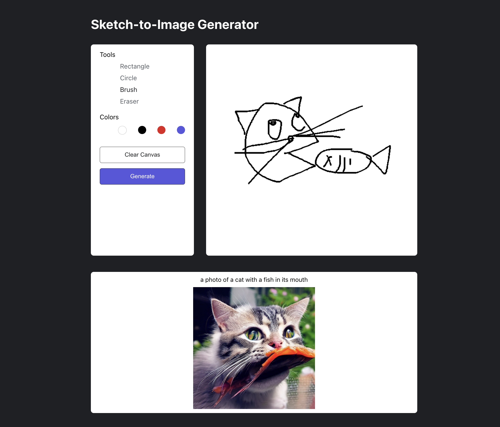

## 낙서 기반 그림 변환 서비스

<div align="center">


<a href="https://github.com/seodaegal/freshman_project/blob/main/%E1%84%82%E1%85%A1%E1%86%A8%E1%84%89%E1%85%A5%20%E1%84%80%E1%85%B5%E1%84%87%E1%85%A1%E1%86%AB%20%E1%84%80%E1%85%B3%E1%84%85%E1%85%B5%E1%86%B7%20%E1%84%87%E1%85%A7%E1%86%AB%E1%84%92%E1%85%AA%E1%86%AB%20%E1%84%89%E1%85%A5%E1%84%87%E1%85%B5%E1%84%89%E1%85%B3%20%E1%84%8E%E1%85%AC%E1%84%8C%E1%85%A9%E1%86%BC%E1%84%87%E1%85%A1%E1%86%AF%E1%84%91%E1%85%AD.pdf">See Details</a>
</div>

### How To Run

**1. Flask Server**

```sh
cd server
pip install -r requirements.txt
flask run
```

**2. React Client**

```sh
cd client
npm install
npm start
```

